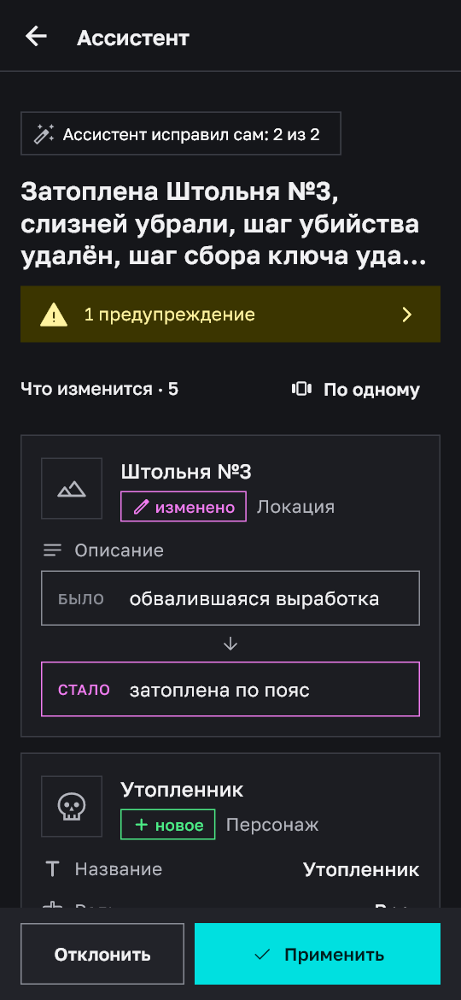
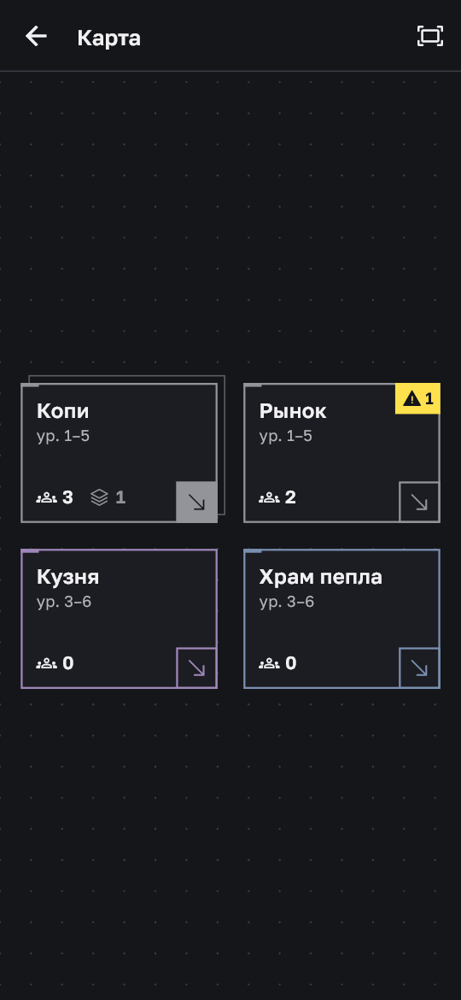

# RPG Builder — кузница игрового контента RPG

Мобильное приложение для разработчика RPG. Автор описывает мир своей игры — места, персонажей,
предметы, квесты — а ИИ-ассистент меняет его по одной фразе: «третья штольня теперь затоплена».

**Главное свойство: мир при этом не ломается.** Ассистент только предлагает план. Приложение
проверяет план на копии мира, показывает «было → стало», ждёт подтверждения автора, и любое
изменение откатывается.

| Просьба | План «было → стало» | История и откат | Карта мест |
|---|---|---|---|
|  |  |  |  |

## Зачем

Задумка игры живёт и меняется, а связанный контент — квест → враг → ключ → другой квест — при
каждой правке расходится. Автор ищет связи руками, что-то забывает, а дыры находят игроки.

RPG Builder держит связи сам: затопили штольню — ассистент уберёт оттуда слизней, поправит шаги
квеста, а проверка мира покажет всё, что осталось висеть.

## Что умеет

- **Мир из связанных объектов**: места с вложенностью до 3 уровней, персонажи, предметы, квесты.
- **Ассистент правок**: просьба фразой или фото скетча → план → проверка на копии → применение.
- **Проверка мира**: правила связей и чисел, написанные кодом, а не доверенные модели.
- **История**: каждое изменение записано и откатывается.
- **Карта**: холст мест с перетаскиванием и входом на уровень ниже.
- **Экспорт в JSON** под `JsonUtility` — файл читают Unity, Godot и Flame.
- **Библиотека Open5e**: готовые существа и предметы в свой мир.

Чего продукт сознательно не делает — в [VISION.md](VISION.md), что уже сделано и чем проверяется —
в [FEATURES.md](FEATURES.md).

## Как устроено

| Часть | На чём |
|---|---|
| Приложение | Flutter / Dart (`lib/`) |
| База, вход, права доступа | Supabase: Postgres + RLS (`supabase/migrations/`) |
| Ассистент | серверная функция Supabase на TypeScript (`supabase/functions/assistant/`) |
| Модели | Groq, Mistral, Z.ai, Gemini — на выбор, достаточно одного ключа |

Модель не пишет в базу напрямую. Она возвращает план, сервер проверяет его по схеме и правилам
мира, приложение применяет план только после «Применить».

## Запуск со своим сервером

В репозитории **нет адреса сервера и ключей** — только код. Чтобы запустить приложение, нужен
свой проект Supabase и свой ключ хотя бы одной модели.

Понадобятся: [Flutter](https://docs.flutter.dev/get-started/install) 3.47+,
[Supabase CLI](https://supabase.com/docs/guides/cli), бесплатный аккаунт Supabase и ключ модели
(например, бесплатный [Groq](https://console.groq.com/keys)).

### 1. Сервер

Создайте проект на [supabase.com](https://supabase.com), затем из папки репозитория:

```bash
supabase login
supabase link --project-ref <имя-вашего-проекта>
supabase db push                              # таблицы и права доступа
supabase secrets set GROQ_API_KEY=<ваш-ключ>  # или MISTRAL_API_KEY, ZAI_API_KEY, GEMINI_API_KEY
supabase functions deploy assistant           # ассистент
```

Ключ модели хранится только на сервере, в секретах функции. В приложение и в репозиторий он не
попадает.

### 2. Файл `.env`

```bash
cp .env.example .env
```

Впишите в `.env` адрес проекта и публичный ключ (Supabase → Project Settings → API):

```
SUPABASE_URL=https://<имя-вашего-проекта>.supabase.co
SUPABASE_KEY=sb_publishable_...
```

`.env` записан в `.gitignore` и в репозиторий не уходит.

### 3. Сборка

```bash
flutter pub get
flutter run --dart-define-from-file=.env
# или APK для телефона:
flutter build apk --release --dart-define-from-file=.env
```

Собрали без `.env` — приложение покажет экран «Сервер не задан».

## ⚠️ Собранное приложение содержит ваши адрес и ключ

Адрес сервера и публичный ключ **вшиваются в APK при сборке**. Достать их из файла приложения —
дело пяти минут. Поэтому:

- **Отдали кому-то свой APK — отдали доступ к своему серверу.** Этот человек (и все, кому он
  перешлёт файл) сможет зарегистрироваться и пользоваться ассистентом за счёт вашего лимита модели.
- Чужие миры он не увидит: данные каждого автора закрыты правами доступа (RLS). Но запросы
  к модели тратятся с вашего ключа.
- Секретные ключи (`service_role`, ключи моделей) в `.env` приложения не кладите никогда —
  только `SUPABASE_URL` и публичный `SUPABASE_KEY`.

Если собираетесь раздавать сборку, сначала ограничьте расход на сервере:

| Мера | Где |
|---|---|
| Закрыть свободную регистрацию | Supabase → Authentication → Sign In / Providers → «Allow new users to sign up» |
| Включить подтверждение почты | там же, «Confirm email» |
| Поставить лимит расхода у провайдера модели | личный кабинет провайдера |

## Проверка

```bash
bash scripts/check.sh
```

Одна команда: анализатор Dart, тесты экранов, тесты прав доступа в настоящей базе и тесты
серверной функции с подменённой моделью. Она же следит, чтобы адрес сервера и ключ не попали
в репозиторий.

Тестам с базой нужны три тестовых автора в вашем проекте — файл `.env.test` (тоже не в git):

```
RPGB_TEST_EMAIL_A=<почта автора для показа руками>
RPGB_TEST_EMAIL_B=<почта «чужого» автора>
RPGB_TEST_EMAIL_T=<почта автора, под которым ходят тесты>
RPGB_TEST_PASSWORD=<общий пароль>
```

Авторы регистрируются сами при первом прогоне; подтверждение почты в проекте на это время
должно быть выключено.

## Как это сделано

Проект ведётся с ИИ-агентами (Claude Code) по жёсткому протоколу: замысел зафиксирован
в `VISION.md`, каждая возможность в `FEATURES.md` закрыта командой, которая падает, если
возможность сломана, а «готово» засчитывается только после зелёного `scripts/check.sh`.
Текущее состояние работы — в `STATE.md`.

Курсовая работа, 2026–2027.
